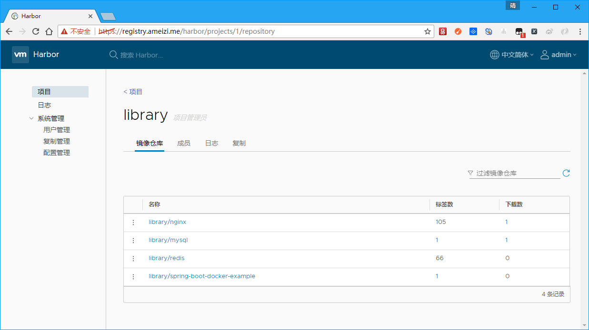
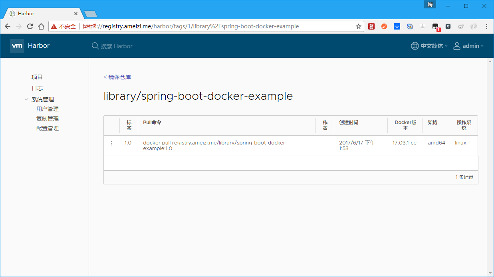

# spring-boot-docker-example

### 1、spotify公司docker-maven-plugin使用

* build

```bash
mvn clean package docker:build
```
* build & push

```bash
mvn clean package docker:build -DpushImage
```

### 2、fabric8公司docker-maven-plugin使用

* build

```bash
mvn clean package docker:build
```
* run

```bash
mvn clean package docker:build docker:run
```
* stop

```bash
mvn docker:stop
```

### 3、docker-compose

`docker-compose.yml`文件中使用到了`ameizi/spring-boot-docker-example`镜像，因此首先需要进行`ameizi/spring-boot-docker-example`镜像的构建

在`docker-compose.yml`目录中执行如下命令

```bash
docker-compose up -d
```

```bash
docker-compose stop
```

### 4、配合私服使用

spotify插件使用注意事项

1、在settings.xml文件中做如下配置

```
<server>
    <id>registry.ameizi.me</id>
    <username>admin</username>
    <password>admin</password>
    <configuration>
        <email>sxyx2008@163.com</email>
    </configuration>
</server>
```

其中`registry.ameizi.me`与pom.xml中的`serverId`一致

2、设置`DOCKER_HOST`环境变量

```
set DOCKER_HOST=tcp://registry.ameizi.me:2376
```

3、构建并推送到私服

```
C:\Users\Administrator\Desktop\spring-boot-docker-example>mvn com.spotify:docker-maven-plugin:build
[INFO] Scanning for projects...
[INFO]
[INFO] ------------------------------------------------------------------------
[INFO] Building spring-boot-docker-example 1.0
[INFO] ------------------------------------------------------------------------
[INFO]
[INFO] --- docker-maven-plugin:0.4.13:build (default-cli) @ spring-boot-docker-example ---
[INFO] Copying C:\Users\Administrator\Desktop\spring-boot-docker-example\target\spring-boot-docker-example-1.0.jar -> C:\Users\Administrator\Desktop\spring-boo
t-docker-example\target\docker\spring-boot-docker-example-1.0.jar
[INFO] Copying src\main\docker\Dockerfile -> C:\Users\Administrator\Desktop\spring-boot-docker-example\target\docker\Dockerfile
[INFO] Building image registry.ameizi.me/library/spring-boot-docker-example:1.0
Step 1/6 : FROM openjdk:latest
 ---> ab0ecda9094c
Step 2/6 : VOLUME /tmp
 ---> Using cache
 ---> ceb5a4228911
Step 3/6 : ADD *.jar app.jar
 ---> Using cache
 ---> 4716db640540
Step 4/6 : RUN sh -c 'touch /app.jar'
 ---> Using cache
 ---> da718a6318c8
Step 5/6 : ENV JAVA_OPTS ""
 ---> Using cache
 ---> f7ecdabe32b7
Step 6/6 : ENTRYPOINT sh -c java $JAVA_OPTS -Djava.security.egd=file:/dev/./urandom -jar /app.jar
 ---> Using cache
 ---> 71176ceebe9e
Successfully built 71176ceebe9e
[INFO] Built registry.ameizi.me/library/spring-boot-docker-example:1.0
[INFO] Tagging registry.ameizi.me/library/spring-boot-docker-example:1.0 with latest
[INFO] Tagging registry.ameizi.me/library/spring-boot-docker-example:1.0 with 1.0
[INFO] Pushing registry.ameizi.me/library/spring-boot-docker-example:1.0
The push refers to a repository [registry.ameizi.me/library/spring-boot-docker-example]
a1f3a5dbf033: Preparing
de474ef140e0: Preparing
bfee0515af91: Preparing
2afcf4c557eb: Preparing
72cfa243711c: Preparing
9bf603e17b04: Preparing
70b22baddf90: Preparing
596ecbaf3ba4: Preparing
445ed6ee6867: Preparing
c59fa6cbcbd9: Preparing
8d4d1ab5ff74: Preparing
9bf603e17b04: Waiting
70b22baddf90: Waiting
596ecbaf3ba4: Waiting
445ed6ee6867: Waiting
c59fa6cbcbd9: Waiting
8d4d1ab5ff74: Waiting
2afcf4c557eb: Layer already exists
72cfa243711c: Layer already exists
9bf603e17b04: Layer already exists
bfee0515af91: Layer already exists
a1f3a5dbf033: Pushing [>                                                  ] 197.1 kB/17.75 MB
70b22baddf90: Layer already exists
de474ef140e0: Pushing [>                                                  ] 197.1 kB/17.75 MB
596ecbaf3ba4: Layer already exists
445ed6ee6867: Layer already exists
a1f3a5dbf033: Pushing [==>                                                ] 786.9 kB/17.75 MB
c59fa6cbcbd9: Layer already exists
de474ef140e0: Pushing [==>                                                ] 786.9 kB/17.75 MB
8d4d1ab5ff74: Layer already exists
a1f3a5dbf033: Pushing [===>                                               ]  1.18 MB/17.75 MB
de474ef140e0: Pushing [===>                                               ]  1.18 MB/17.75 MB
a1f3a5dbf033: Pushing [====>                                              ]  1.77 MB/17.75 MB
de474ef140e0: Pushing [====>                                              ]  1.77 MB/17.75 MB
a1f3a5dbf033: Pushing [======>                                            ] 2.163 MB/17.75 MB
a1f3a5dbf033: Pushing [=======>                                           ] 2.753 MB/17.75 MB
de474ef140e0: Pushing [======>                                            ]  2.36 MB/17.75 MB
a1f3a5dbf033: Pushing [=========>                                         ] 3.343 MB/17.75 MB
de474ef140e0: Pushing [========>                                          ]  2.95 MB/17.75 MB
a1f3a5dbf033: Pushing [==========>                                        ] 3.736 MB/17.75 MB
de474ef140e0: Pushing [==========>                                        ] 3.736 MB/17.75 MB
a1f3a5dbf033: Pushing [===========>                                       ] 4.129 MB/17.75 MB
de474ef140e0: Pushing [============>                                      ] 4.522 MB/17.75 MB
a1f3a5dbf033: Pushing [=============>                                     ] 4.719 MB/17.75 MB
de474ef140e0: Pushing [=============>                                     ] 4.916 MB/17.75 MB
a1f3a5dbf033: Pushing [==============>                                    ] 5.112 MB/17.75 MB
de474ef140e0: Pushing [==============>                                    ] 5.309 MB/17.75 MB
a1f3a5dbf033: Pushing [================>                                  ] 5.702 MB/17.75 MB
de474ef140e0: Pushing [================>                                  ] 5.702 MB/17.75 MB
a1f3a5dbf033: Pushing [=================>                                 ] 6.292 MB/17.75 MB
de474ef140e0: Pushing [=================>                                 ] 6.095 MB/17.75 MB
a1f3a5dbf033: Pushing [===================>                               ] 6.882 MB/17.75 MB
de474ef140e0: Pushing [==================>                                ] 6.685 MB/17.75 MB
de474ef140e0: Pushing [===================>                               ] 7.078 MB/17.75 MB
a1f3a5dbf033: Pushing [=====================>                             ] 7.472 MB/17.75 MB
de474ef140e0: Pushing [=====================>                             ] 7.668 MB/17.75 MB
a1f3a5dbf033: Pushing [======================>                            ] 7.865 MB/17.75 MB
de474ef140e0: Pushing [======================>                            ] 8.061 MB/17.75 MB
a1f3a5dbf033: Pushing [=======================>                           ] 8.455 MB/17.75 MB
de474ef140e0: Pushing [=======================>                           ] 8.455 MB/17.75 MB
a1f3a5dbf033: Pushing [=========================>                         ] 9.044 MB/17.75 MB
de474ef140e0: Pushing [=========================>                         ] 9.044 MB/17.75 MB
a1f3a5dbf033: Pushing [===========================>                       ] 9.634 MB/17.75 MB
de474ef140e0: Pushing [===========================>                       ] 9.634 MB/17.75 MB
a1f3a5dbf033: Pushing [============================>                      ] 10.22 MB/17.75 MB
de474ef140e0: Pushing [============================>                      ] 10.22 MB/17.75 MB
a1f3a5dbf033: Pushing [==============================>                    ] 10.81 MB/17.75 MB
de474ef140e0: Pushing [==============================>                    ] 10.81 MB/17.75 MB
a1f3a5dbf033: Pushing [================================>                  ]  11.4 MB/17.75 MB
de474ef140e0: Pushing [===============================>                   ] 11.21 MB/17.75 MB
a1f3a5dbf033: Pushing [=================================>                 ]  11.8 MB/17.75 MB
de474ef140e0: Pushing [=================================>                 ]  11.8 MB/17.75 MB
a1f3a5dbf033: Pushing [=================================>                 ] 11.99 MB/17.75 MB
de474ef140e0: Pushing [==================================>                ] 12.39 MB/17.75 MB
a1f3a5dbf033: Pushing [===================================>               ] 12.58 MB/17.75 MB
de474ef140e0: Pushing [====================================>              ] 12.98 MB/17.75 MB
a1f3a5dbf033: Pushing [=====================================>             ] 13.17 MB/17.75 MB
de474ef140e0: Pushing [======================================>            ] 13.57 MB/17.75 MB
a1f3a5dbf033: Pushing [======================================>            ] 13.76 MB/17.75 MB
de474ef140e0: Pushing [=======================================>           ] 14.16 MB/17.75 MB
de474ef140e0: Pushing [========================================>          ] 14.55 MB/17.75 MB
a1f3a5dbf033: Pushing [========================================>          ] 14.35 MB/17.75 MB
de474ef140e0: Pushing [==========================================>        ] 15.14 MB/17.75 MB
a1f3a5dbf033: Pushing [==========================================>        ] 14.94 MB/17.75 MB
de474ef140e0: Pushing [============================================>      ] 15.73 MB/17.75 MB
a1f3a5dbf033: Pushing [===========================================>       ] 15.53 MB/17.75 MB
a1f3a5dbf033: Pushing [============================================>      ] 15.93 MB/17.75 MB
de474ef140e0: Pushing [=============================================>     ] 16.32 MB/17.75 MB
a1f3a5dbf033: Pushing [==============================================>    ] 16.52 MB/17.75 MB
de474ef140e0: Pushing [===============================================>   ] 16.91 MB/17.75 MB
a1f3a5dbf033: Pushing [===============================================>   ] 16.91 MB/17.75 MB
de474ef140e0: Pushing [================================================>  ]  17.3 MB/17.75 MB
a1f3a5dbf033: Pushing [================================================>  ]  17.3 MB/17.75 MB
de474ef140e0: Pushing [==================================================>] 17.75 MB
a1f3a5dbf033: Pushing [==================================================>] 17.75 MB
de474ef140e0: Pushed
a1f3a5dbf033: Pushed
?[10B1.0: digest: sha256:72a7592db15f7f670bad37b2022a8e43f918d3800fcbe42eef60eafd6c9e6a2d size: 2631
null: null
[INFO] ------------------------------------------------------------------------
[INFO] BUILD SUCCESS
[INFO] ------------------------------------------------------------------------
[INFO] Total time: 15.649 s
[INFO] Finished at: 2017-06-17T13:31:22+08:00
[INFO] Final Memory: 32M/331M
[INFO] ------------------------------------------------------------------------
```

fabric8插件使用注意事项

1、在pom.xml中做如下配置

```
<configuration>
    <dockerHost>http://registry.ameizi.me:2376</dockerHost>
    <pushRegistry>${docker.repostory}</pushRegistry>
    <authConfig>
        <!-- 镜像仓库用户名密码 -->
        <username>admin</username>
        <password>admin</password>
    </authConfig>
</configuration>
```

2、构建

```
C:\Users\Administrator\Desktop\spring-boot-docker-example>mvn io.fabric8:docker-maven-plugin:build
[INFO] Scanning for projects...
[INFO]
[INFO] ------------------------------------------------------------------------
[INFO] Building spring-boot-docker-example 1.0
[INFO] ------------------------------------------------------------------------
[INFO]
[INFO] --- docker-maven-plugin:0.21.0:build (default-cli) @ spring-boot-docker-example ---
[INFO] Copying files to C:\Users\Administrator\Desktop\spring-boot-docker-example\target\docker\library\spring-boot-docker-example\1.0\build\maven
[INFO] Building tar: C:\Users\Administrator\Desktop\spring-boot-docker-example\target\docker\library\spring-boot-docker-example\1.0\tmp\docker-build.tar
[INFO] DOCKER> [library/spring-boot-docker-example:1.0] "app": Created docker-build.tar in 2 seconds
[INFO] DOCKER> Step 1/4 : FROM openjdk:latest
[INFO] DOCKER> ---> ab0ecda9094c
[INFO] DOCKER> Step 2/4 : EXPOSE 8080
[INFO] DOCKER> ---> Using cache
[INFO] DOCKER> ---> fa600785c2b7
[INFO] DOCKER> Step 3/4 : COPY maven /maven/
[INFO] DOCKER> ---> Using cache
[INFO] DOCKER> ---> ce0e22ad4174
[INFO] DOCKER> Step 4/4 : ENTRYPOINT java -Djava.security.egd=file:/dev/./urandom -jar /maven/spring-boot-docker-example-1.0.jar
[INFO] DOCKER> ---> Using cache
[INFO] DOCKER> ---> cbdc89609f72
[INFO] DOCKER> Successfully built cbdc89609f72
[INFO] DOCKER> [library/spring-boot-docker-example:1.0] "app": Built image sha256:cbdc8
[INFO] DOCKER> [library/spring-boot-docker-example:1.0] "app": Tag with 1.0
[INFO] ------------------------------------------------------------------------
[INFO] BUILD SUCCESS
[INFO] ------------------------------------------------------------------------
[INFO] Total time: 5.988 s
[INFO] Finished at: 2017-06-17T13:49:57+08:00
[INFO] Final Memory: 18M/308M
[INFO] ------------------------------------------------------------------------
```

3、推送

```
C:\Users\Administrator\Desktop\spring-boot-docker-example>mvn io.fabric8:docker-maven-plugin:push
[INFO] Scanning for projects...
[INFO]
[INFO] ------------------------------------------------------------------------
[INFO] Building spring-boot-docker-example 1.0
[INFO] ------------------------------------------------------------------------
[INFO]
[INFO] --- docker-maven-plugin:0.21.0:push (default-cli) @ spring-boot-docker-example ---

[INFO] DOCKER> The push refers to a repository [registry.ameizi.me/library/spring-boot-docker-example]
#
[INFO] DOCKER> 1.0: digest: sha256:00fbb2be6828c03c79a1bab473809247ce488fa4f51ef30ade85d270f5d851f5 size: 2419

[INFO] DOCKER> Pushed library/spring-boot-docker-example:1.0 in 2 seconds

[INFO] DOCKER> The push refers to a repository [registry.ameizi.me/library/spring-boot-docker-example]
#
[INFO] DOCKER> 1.0: digest: sha256:00fbb2be6828c03c79a1bab473809247ce488fa4f51ef30ade85d270f5d851f5 size: 2419

[INFO] ------------------------------------------------------------------------
[INFO] BUILD SUCCESS
[INFO] ------------------------------------------------------------------------
[INFO] Total time: 6.012 s
[INFO] Finished at: 2017-06-17T13:51:19+08:00
[INFO] Final Memory: 19M/331M
[INFO] ------------------------------------------------------------------------
```






### 注意事项

1、docker开启2376或2375监听端口

ubuntu环境中修改`/etc/default/docker`文件后重启`docker`服务

```
DOCKER_OPTS="$DOCKER_OPTS --registry-mirror=https://ex93eg1r.mirror.aliyuncs.com -H unix:///var/run/docker.sock -H tcp://0.0.0.0:2376"
```

2、harbor私服搭建教程

https://github.com/ameizi/DevArticles/issues/164

### 参考文档

https://docs.docker.com/engine/reference/builder/

https://docs.docker.com/compose/compose-file/

https://github.com/spotify/docker-maven-plugin

https://dmp.fabric8.io

http://www.cnblogs.com/kingsy/p/6411371.html

https://docs.docker.com/engine/reference/commandline/dockerd/